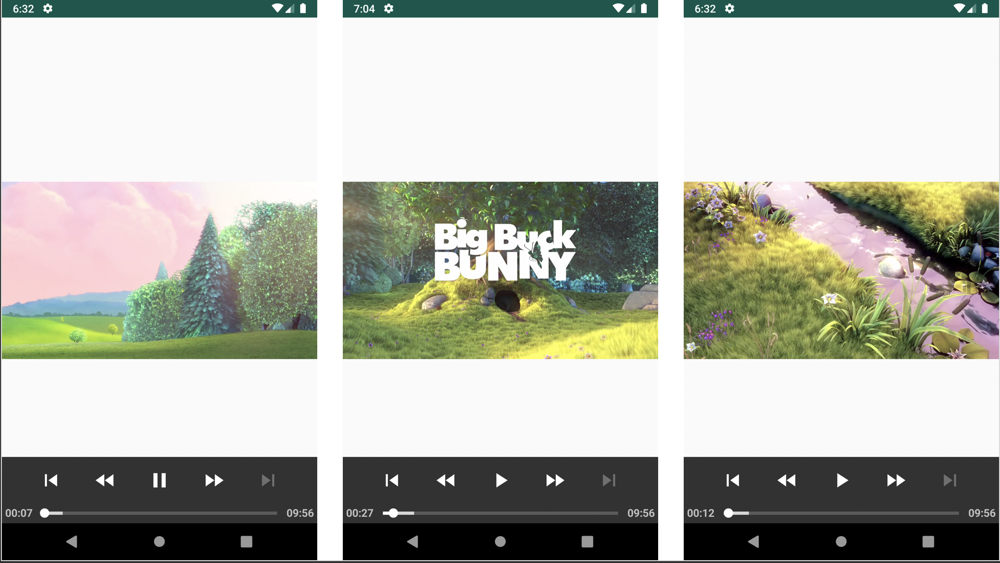

## How to use ExoPlayer with Kotlin in Android?

ExoPlayer is an application level media player for Android. It provides an alternative to Android’s MediaPlayer API for playing audio and video both locally and over the Internet. ExoPlayer supports features not currently supported by Android’s MediaPlayer API, including DASH and SmoothStreaming adaptive playbacks. Unlike the MediaPlayer API, ExoPlayer is easy to customize and extend, and can be updated through Play Store application updates.

## ExoPlayer App Screenshots

The application is playing content with .mp4 extension. The video can be rolled forward. The video can be undone.
