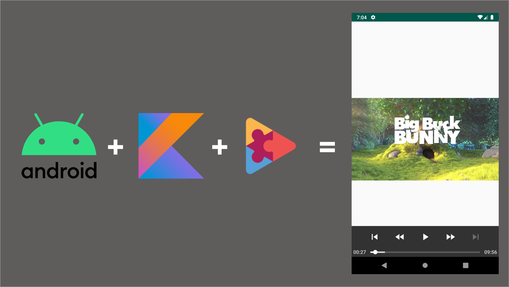
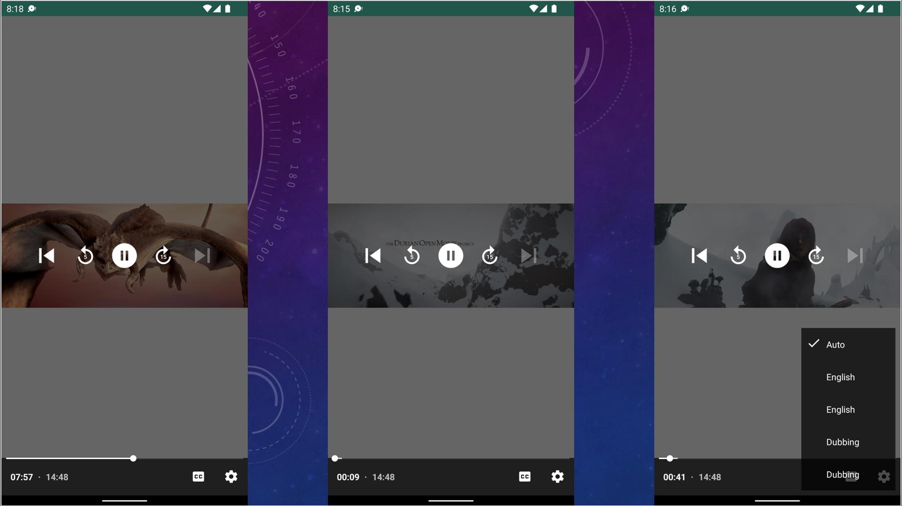
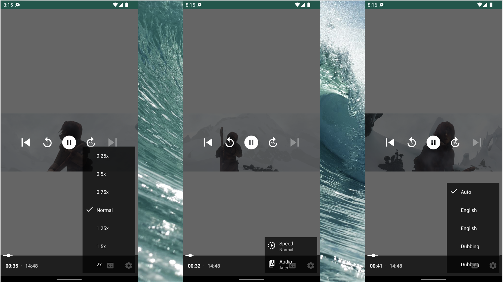

## How to use ExoPlayer ▶️ with Kotlin in Android ⁉️



**ExoPlayer** is an application level media player for Android. It provides an alternative to Android’s MediaPlayer API for playing audio and video both locally and over the Internet. ExoPlayer supports features not currently supported by Android’s MediaPlayer API, including **DASH** and **SmoothStreaming** adaptive playbacks. Unlike the MediaPlayer API, ExoPlayer is easy to customize and extend, and can be updated through Play Store application updates.

When defining the formats that ExoPlayer supports, it’s important to note that “media formats” are defined at multiple levels. From the lowest level to the highest, these are:

The format of the individual media samples (e.g., a frame of video or a frame of audio). These are sample formats. Note that a typical video file will contain media in at least two sample formats; one for video (e.g., H.264) and one for audio (e.g., AAC).
The format of the container that houses the media samples and associated metadata. These are container formats. A media file has a single container format (e.g., MP4), which is commonly indicated by the file extension. Note that for some audio only formats (e.g., MP3), the sample and container formats may be the same.
Adaptive streaming technologies such as DASH, SmoothStreaming and HLS. These are not media formats as such, however it’s still necessary to define what level of support ExoPlayer provides.

For more detailed information about Exoplayer, you can review the following article: 👇🏻

https://medium.com/@halilozel1903/exoplayer-nedir-ccae84e9f115

## ExoPlayer 🎥 App 📱 Screenshots 🖼



<br>



To turn on the Subtitle option on the player screen:

```kotlin 
app:show_subtitle_button="true"
```

To turn on the Audio option on the Player Screen:

```kotlin 
argType:show_subtitle_button="true"
```

The application is playing content with **.hls** extension. The video can be rolled forward. The video can be undone.

## Donation 💸

If this project help 💁 you reduce time to develop, you can give me a cup of coffee. ☕

[](https://www.buymeacoffee.com/halilozel)

## License ℹ️
```
MIT License

Copyright (c) 2022 Halil OZEL

Permission is hereby granted, free of charge, to any person obtaining a copy
of this software and associated documentation files (the "Software"), to deal
in the Software without restriction, including without limitation the rights
to use, copy, modify, merge, publish, distribute, sublicense, and/or sell
copies of the Software, and to permit persons to whom the Software is
furnished to do so, subject to the following conditions:

The above copyright notice and this permission notice shall be included in all
copies or substantial portions of the Software.

THE SOFTWARE IS PROVIDED "AS IS", WITHOUT WARRANTY OF ANY KIND, EXPRESS OR
IMPLIED, INCLUDING BUT NOT LIMITED TO THE WARRANTIES OF MERCHANTABILITY,
FITNESS FOR A PARTICULAR PURPOSE AND NONINFRINGEMENT. IN NO EVENT SHALL THE
AUTHORS OR COPYRIGHT HOLDERS BE LIABLE FOR ANY CLAIM, DAMAGES OR OTHER
LIABILITY, WHETHER IN AN ACTION OF CONTRACT, TORT OR OTHERWISE, ARISING FROM,
OUT OF OR IN CONNECTION WITH THE SOFTWARE OR THE USE OR OTHER DEALINGS IN THE
SOFTWARE.
```
